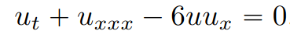
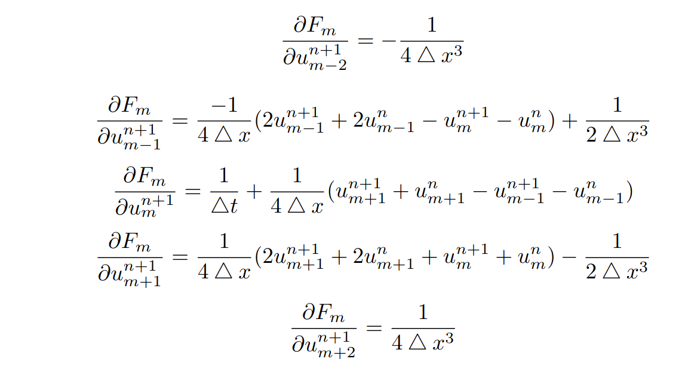

# Simulação da Equação KDV com Método Implícito Crank-Nicolson
## Bibliotecas utilizadas
Eigen: https://eigen.tuxfamily.org
## Equação KDV utilizada

## Esquema de diferenças finitas utilizado:

## Derivadas parciais para o Método de Newton

